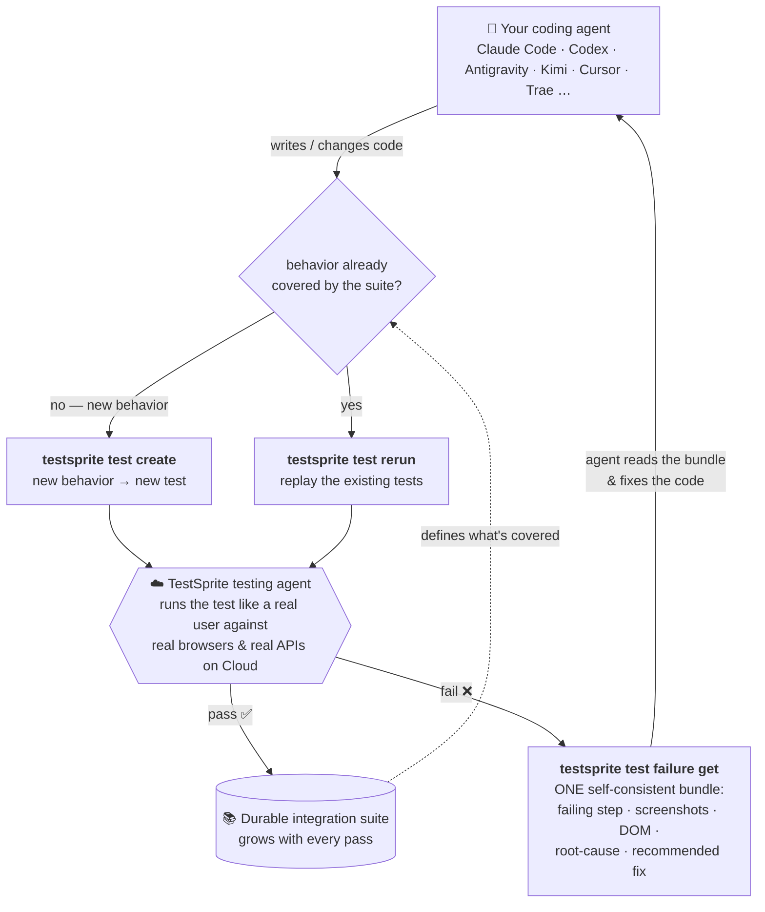

<div align="center">

<a href="https://www.testsprite.com">
  <picture>
    <source media="(prefers-color-scheme: dark)" srcset="assets/testsprite-logo-dark.png">
    <source media="(prefers-color-scheme: light)" srcset="assets/testsprite-logo-light.png">
    
  </picture>
</a>

### The verification layer for the agentic coding era.

AI ships code in minutes — verifying it hasn't. `testsprite` opens your live app, uses it like a real user, and shows your coding agent exactly what broke — so it fixes its own work before a bug ever reaches you.

<sub><b>Proof, in public: verification beats model size.</b> With this CLI in the loop, the cheapest model in the field shipped the most correct app on an open leaderboard — <b>89%</b>, at half the cost of the priciest one. <a href="https://codercup.ai">See the leaderboard →</a></sub>

<p>
  <a href="https://www.npmjs.com/package/@testsprite/testsprite-cli"></a>
  <a href="https://www.npmjs.com/package/@testsprite/testsprite-cli"></a>
  <a href="#quickstart"></a>
  <a href="./LICENSE"></a>
  <a href="https://github.com/TestSprite/testsprite-cli/actions/workflows/ci.yml"></a>
</p>

<p>
  <a href="https://www.testsprite.com"></a>
  <a href="https://www.testsprite.com/docs"></a>
  <a href="https://x.com/Test_Sprite"></a>
  <a href="https://www.linkedin.com/company/testsprite"></a>
  <a href="https://discord.gg/W4JDrZfdB"></a>
</p>

⭐ _Help us reach more developers and grow the TestSprite community. Star this repo!_

</div>

<video src="https://github.com/user-attachments/assets/eca90a91-93ef-49f6-8d13-86b4eb25f4cf" controls muted></video>

<p align="center"><sub><b><a href="https://github.com/user-attachments/assets/eca90a91-93ef-49f6-8d13-86b4eb25f4cf">▶ Watch the launch video</a></b> — the three hard limits every coding agent hits, and the loop that breaks them (4 min).</sub></p>

---

## What is it?

[TestSprite](https://www.testsprite.com) is the AI testing platform 100,000+ teams use to test their software, frontend and backend — in the cloud, against the live product, not mocks. This repo is its official CLI.

It puts that platform in your coding agent's hands: the agent verifies every behavior it ships, and what broke comes back as **one self-consistent bundle** it can act on — no dashboard scraping. Humans drive the same surface from a terminal or CI.

## ⭐️ Star the Repository


If you find `testsprite` useful, a GitHub Star ⭐️ would be greatly appreciated — it helps other builders (and their agents) find the project, and stars notify you about new releases.

## Quickstart

Requires **Node.js 20.19+**, **22.13+**, or **24+**. (No global install? `npx @testsprite/testsprite-cli` works too.)

```bash
npm install -g @testsprite/testsprite-cli
testsprite setup
```

`testsprite setup` prompts for your [API key](https://www.testsprite.com), verifies it, and installs the verification-loop skill for your coding agent (`claude`, `cursor`, `cline`, `windsurf`, `antigravity`, `codex`, etc.) — one command, so your agent is wired to verify its own work. Non-interactive (CI / onboarding scripts):

```bash
TESTSPRITE_API_KEY=sk-... testsprite setup --from-env --yes --agent claude
```

> **Pointing a coding agent (Claude Code, Cursor, Codex, Cline, …) at TestSprite?** Have it run `testsprite setup` first — that installs the verification skill, so the agent knows how to create, run, and triage tests on its own (instead of guessing from this README). New here? Start with the **[getting-started overview](https://docs.testsprite.com/cli/getting-started/overview)**.

> **Privacy note:** interactive runs check the npm registry at most once per 24 h to offer a "new version available" notice — package name only, never your key or data; `TESTSPRITE_NO_UPDATE_NOTIFIER=1` disables it. The backend also advertises its minimum supported CLI version — a below-floor CLI prints a one-line upgrade advisory on stderr, and a too-old client may be rejected with exit 14 (`CLIENT_TOO_OLD`). Details in [DOCUMENTATION.md → Update notice](./DOCUMENTATION.md#update-notice).

From there, the loop runs on its own — an example session, typed by the coding agent:

```bash
# 1 — describe the behavior you want to guarantee, run it, wait
testsprite test create --project proj_8f0f6 --type frontend \
  --plan-from ./checkout-flow.plan.json --run --wait --output json
#   → exits 1: the run failed

# 2 — pull ONE self-consistent failure bundle
testsprite test failure get test_3a9f21c7 --out ./.testsprite/failure

# 3 — the agent reads the bundle, fixes the code, then replays
testsprite test rerun test_3a9f21c7 --wait --output json
#   → exits 0: passed. The test now lives in your durable suite.
```

Prefer to configure each step by hand (or learn the surface offline with `--dry-run` first)? See [Manual setup](./DOCUMENTATION.md#manual-setup) and [Install & verify](./DOCUMENTATION.md#install--verify).

## Commands

| Group     | Command                                                | What it does                                                                                                                                          |
| --------- | ------------------------------------------------------ | ----------------------------------------------------------------------------------------------------------------------------------------------------- |
| **Setup** | `setup`                                                | **Start here** — one command: configure your API key, verify it, and install the agent verification skill                                             |
|           | `doctor`                                               | Environment diagnostic — CLI/Node versions, profile, endpoint, credentials, connectivity, agent skill; exits non-zero on failure                      |
| **Auth**  | `auth status`                                          | Resolve the active profile to its user, key, env, and scopes                                                                                          |
|           | `auth remove`                                          | Remove the active profile from the credentials file                                                                                                   |
|           | `usage` (alias `credits`)                              | Account pre-flight: identity, plus credit balance / plan info when the backend supplies them                                                          |
| **Read**  | `project list` / `project get`                         | List projects / fetch one by id                                                                                                                       |
|           | `test list` / `test get`                               | List tests under a project / fetch one by id                                                                                                          |
|           | `test code get`                                        | Print (or write) the generated test source                                                                                                            |
|           | `test steps`                                           | List the latest run's steps with screenshot / DOM pointers                                                                                            |
|           | `test result`                                          | Latest result; `--history` lists a test's prior runs                                                                                                  |
|           | `test failure get`                                     | The agent entry point: one self-contained latest-failure bundle                                                                                       |
|           | `test failure summary`                                 | One-screen triage card (no media download)                                                                                                            |
|           | `test diff`                                            | Compare two runs — verdict, failure kind, per-step status flips, code-version drift                                                                   |
| **Write** | `test scaffold` / `test lint`                          | Author plans locally: emit a schema-correct starter, validate plan files offline — no network, no credentials                                         |
|           | `test create` / `test create-batch`                    | Create a test (or bulk-create from a plan file); `--produces` / `--needs` / `--category` wire BE dependency metadata                                  |
|           | `test update` / `test delete` / `test delete-batch`    | Edit metadata and BE dependency declarations (`--produces` / `--needs` / `--category`) / permanently delete (no restore window; `--confirm` required) |
|           | `test code put`                                        | Replace generated code (etag-guarded)                                                                                                                 |
|           | `test plan put`                                        | Replace a frontend test's plan-steps                                                                                                                  |
|           | `project create` / `project update` / `project delete` | Manage projects; `delete` removes a project and everything under it (`--confirm` required, no restore window)                                         |
|           | `project credential` / `project auto-auth`             | Configure backend-test auth: a static injected credential, or auto-refresh login (Pro)                                                                |
| **Run**   | `test run`                                             | Trigger a fresh run; `--wait` blocks until terminal; `--all --project <id>` runs all tests in a project in wave order                                 |
|           | `test rerun`                                           | Cheap replay of one/many tests (FE verbatim; BE with deps); `--all --project <id>` reruns all tests                                                   |
|           | `test flaky`                                           | Replay a test several times (auto-heal off) and report a stability score                                                                              |
|           | `test wait`                                            | Block on one or more `runId`s until terminal                                                                                                          |
|           | `test cancel`                                          | Cancel one or more in-flight runs (Ctrl-C during `--wait` only detaches — `cancel` is the real stop)                                                  |
|           | `test artifact get`                                    | Download the failure bundle for a specific `runId`                                                                                                    |
| **Agent** | `agent install` / `agent list` / `agent status`        | Add, list, or health-check coding-agent skills (pure-local): `claude`, `codex`, `cursor`, `cline`, `antigravity`, `kiro`, `windsurf`, `copilot`       |

> The earlier command names — `init`, `auth configure`, `auth whoami`, `auth logout` — still work as hidden, deprecated aliases (each prints a one-line notice pointing at the new name), so existing scripts keep running. `auth configure` now runs the full `setup` (it also installs the skill).

📚 **Full reference — every command, flag, and example:** [DOCUMENTATION.md](./DOCUMENTATION.md), including [configuration & profiles](./DOCUMENTATION.md#configuration), [scripting](./DOCUMENTATION.md#output--scripting), and [exit codes](./DOCUMENTATION.md#exit-codes).

## Why a CLI for coding agents?

- 🧪 **Tests like a real user.** Runs against a live browser or API in the cloud — real clicks, real navigation, real assertions. Not a mock.
- 🤖 **Agent-shaped output.** `test failure get` returns **one bundle** — the failing step, its neighbors, screenshots, DOM snapshots, the test source, a root-cause hypothesis, and a recommended fix target — all sharing a single `snapshotId`. The CLI _refuses_ to stitch data from two different runs, so an agent never reasons over a frankenstein context.
- ♻️ **A loop, not a one-shot.** `create → run → failure get → fix → rerun` — every pass is banked, not thrown away.
- 📐 **Scriptable & deterministic.** Stable `--output json` contract, predictable [exit codes](./DOCUMENTATION.md#exit-codes), and a `--dry-run` that exercises the full code path offline with canned data.
- 🔌 **One command to onboard your agent.** `testsprite agent install claude` drops a ready-made skill file into your repo so your coding agent knows how to drive the loop on its own.

## How it works

Every time your agent changes code, it asks one question: **is this behavior already covered by the suite?**

- **Not yet covered** → `testsprite test create` — describe the new behavior, run it.
- **Already covered** → `testsprite test rerun` — replay the existing tests, so nothing that used to work breaks silently.
- **Something fails** → `testsprite test failure get` — one self-consistent bundle; the agent fixes the code and reruns.

Every pass is banked into a durable suite, so coverage compounds as the project grows — a lasting record of every requirement it has ever gotten right, far bigger than any context window.



The cloud is a black box on purpose: your agent describes intent and reads results. It never has to know _how_ the test was driven — only _what_ a real user experienced.

## Proved in public

On [**CoderCup**](https://codercup.ai) — an open leaderboard where frontier coding agents build the _same_ app under the _same_ rules, with TestSprite as the referee — the **cheapest** model in the field shipped the **most correct** app on the board: **89%**, at half the cost of the priciest one.

That's the point of all of this: you no longer need the biggest, most expensive model to ship software you can trust — top-tier quality, without paying top-tier prices, within reach of every team.

## Getting help

- 📚 **CLI reference** — [DOCUMENTATION.md](./DOCUMENTATION.md)
- 🌐 **Platform docs** — [testsprite.com/docs](https://www.testsprite.com/docs)
- 🐛 **Issues & feature requests** — [GitHub issues](https://github.com/TestSprite/testsprite-cli/issues)
- 💬 **Quick questions** — [Discord](https://discord.gg/W4JDrZfdB), or `testsprite --help` / `testsprite test run --help` right in your terminal
- 📝 **Changelog** — [CHANGELOG.md](./CHANGELOG.md)

## Contributing

Contributions are welcome — the CLI is plain TypeScript/Node (20.19+, 22.13+, or 24+), tested with Vitest, built with `tsc`. Getting a dev loop running takes a minute:

```bash
git clone https://github.com/TestSprite/testsprite-cli.git
cd testsprite-cli && npm install
npm run build       # tsc → dist/ ; try it: node dist/index.js --help
npm test            # unit suite — no network or credentials needed
npm run lint:fix    # ESLint
npm run typecheck   # tsc --noEmit
```

Pull requests target the `dev` branch. The full guide — build from source, test tiers, CI gates, branches, project layout — is in [CONTRIBUTING.md](./CONTRIBUTING.md).

**Support** — if you need any help, we're responsive on [Discord](https://discord.gg/W4JDrZfdB), and feel free to email us at [contact@testsprite.com](mailto:contact@testsprite.com) too.

## License

[Apache-2.0](./LICENSE) © TestSprite
